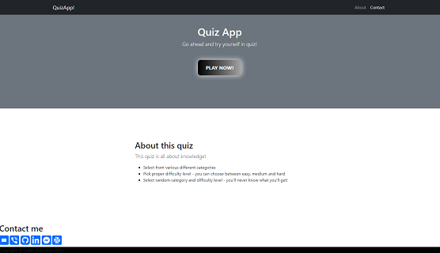
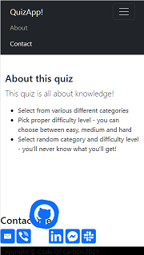
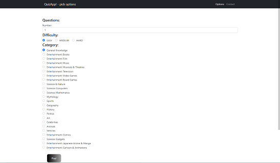
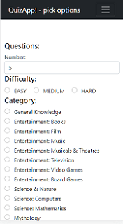
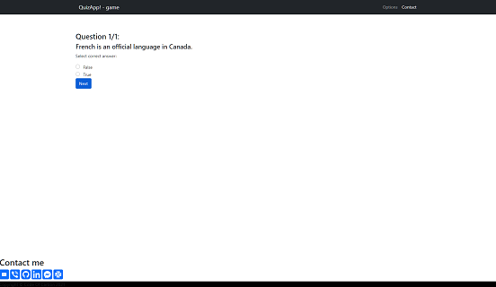
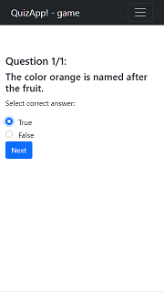
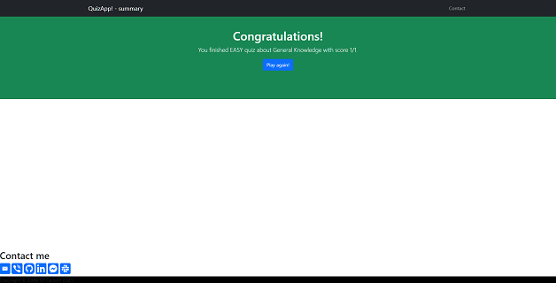

# Quiz App
Web application that uses an external questions database (TriviaDB API)

## Table of contents
* [Overview](#overwiev)
* [Screenshots](#screenshots)
* [Technologies](#technologies)
* [How to start](#how-to-start)
* [To do](#to-do)

## Overview
The aim of this project is to prepare a quiz game in a web version.
The user selects the question category that interests him and the level of difficulty.
On this basis, the application generates a set of questions for the player.
Each of the questions is presented on the browser screen, and the answers are saved.
After answering all the questions from the set, the game ends and the player is presented with the result.

## Screenshots
###### Landing page
 

###### Selecting categories
 

###### Quiz view
 

###### Summary view
 

## Technologies
- Java 11
- Spring Boot 2.5.3
- Lombok 1.18
- Maven 3.6
- H2 Database Engine 1.4
- Thymeleaf 3.0
- HTML, CSS, Bootstrap 5.1
- Hibernate 5.4
- Junit5 5.7.2

## How to start
- Clone the repo:

``https://github.com/codeofcarbon/quizzz_app``

- Run command line in the project directory and type following command:

``mvn clean compile package && cd target && java -jar quizApp-1.0.0.jar``

## To do
- [ ] *Error handling - redirecting to an error page and/or displaying an appropriate error message*
- [ ] *Database for storing tasks downloaded from Open Trivia DB and users scores*
- [ ] *Authentication and authorization*
- [ ] *Administration module*
- [ ] *Multiplayer game*
- [ ] *Time limits*
- [ ] *Highscore table view*
